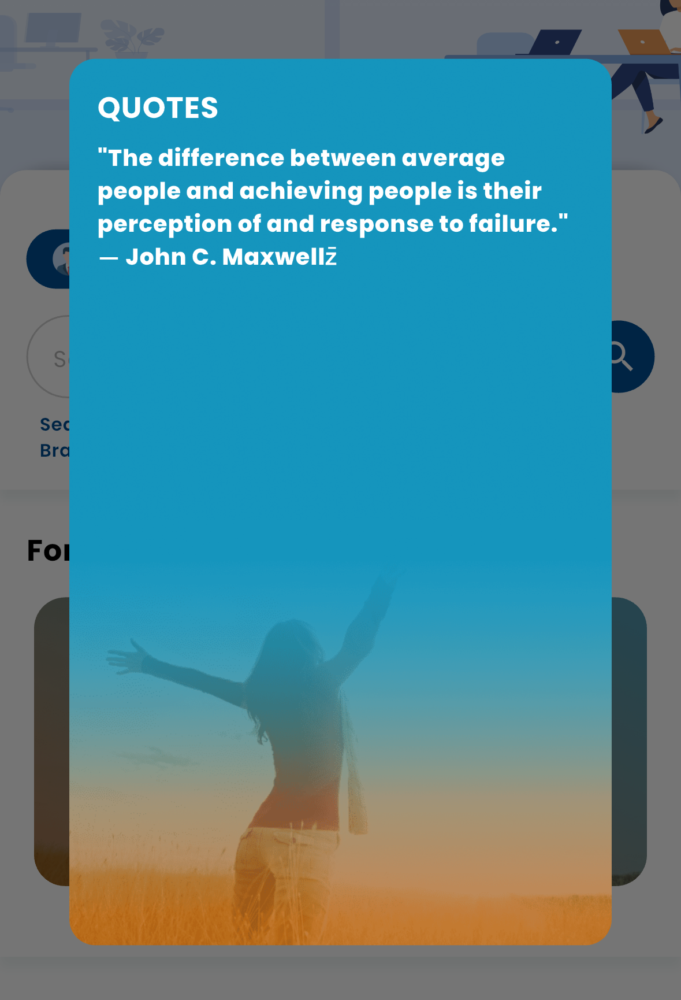

# Dynamic Image Carousel

A customizable and dynamic image carousel widget for Flutter. Use this widget to display images with custom text overlays and enable click-to-open modal functionality.

## Images

Here are some screenshots of how the carousel looks in your app:

### Image 1


### Image 2


## Features

- Display dynamic images with custom text overlays.
- Support for both network and asset images.
- Modal popup with image details.
- Customizable dot indicators for carousel navigation.
- Easy-to-use and highly customizable.

## Installation

To use the `dynamic_image_carousel` package in your Flutter project, add the following to your `pubspec.yaml`:

### Via pub.dev (Recommended for Production)

Once the package is published on `pub.dev`, you can use the following:

```yaml
dependencies:
  dynamic_image_carousel: ^0.0.1  # Replace with the latest version
````

### Via GitHub (If you're using the GitHub version before publishing)

If you're using the GitHub version before it’s published on pub.dev, add the following:

```yaml
dependencies:
  dynamic_image_carousel:
    git:
      url: git://github.com/yourusername/dynamic_image_carousel.git
```

After adding the dependency, run the following command in your terminal to fetch the package:

```bash
flutter pub get
```

## Example Usage

Here’s an example of how to use the `DynamicImageCarousel` widget in your Flutter project:

```dart
import 'package:flutter/material.dart';
import 'package:dynamic_image_carousel/dynamic_image_carousel.dart';

void main() {
  runApp(MaterialApp(
    home: Scaffold(
      appBar: AppBar(title: Text('Dynamic Image Carousel')),
      body: DynamicImageCarousel(
        imageDetails: [
          {
            'url': 'https://example.com/image1.jpg',
            'title': 'Image 1',
            'question': 'What is this?',
            'answer': 'This is Image 1.',
            'bgImage': 'https://example.com/bg1.jpg',
            'isAsset': 'false'
          },
          {
            'url': 'assets/images/image2.jpg',
            'title': 'Image 2',
            'question': 'What is this?',
            'answer': 'This is Image 2.',
            'bgImage': 'assets/images/bg2.jpg',
            'isAsset': 'true'
          },
        ],
        titleTextStyle: TextStyle(fontSize: 20, color: Colors.white),
        questionTextStyle: TextStyle(fontSize: 16, color: Colors.white),
        answerTextStyle: TextStyle(fontSize: 14, color: Colors.white),
        openModalOnClick: true,
        padding: 16.0,
        dotSize: 10.0,
        activeDotColor: Colors.blue,
        inactiveDotColor: Colors.grey,
        borderRadius: 18.0,
      ),
    ),
  ));
}
```

## Parameters

* **imageDetails**: A list of maps, where each map contains the following:

  * `url`: The image URL (network or asset).
  * `title`: Title text to display above the image.
  * `question`: A question related to the image.
  * `answer`: The answer to the question (shown in the modal).
  * `bgImage`: A background image for the modal (network or asset).
  * `isAsset`: A flag (`'true'` or `'false'`) indicating whether the image and background image are assets.

* **titleTextStyle, questionTextStyle, answerTextStyle**: These parameters allow you to customize the text styles for the title, question, and answer. You can pass custom `TextStyle` objects.

* **openModalOnClick**: A boolean value (`true/false`) that controls whether the modal will be opened when an image is clicked. Default is `true`.

* **padding**: Padding applied around the image carousel items. Default is `8.0`.

* **dotSize**: Size of the navigation dots at the bottom of the carousel. Default is `7.0`.

* **activeDotColor & inactiveDotColor**: Colors for the active and inactive dots. Default is `Colors.blue` for the active dot and `Colors.grey` for the inactive dot.

* **borderRadius**: Border radius applied to the images in the carousel. Default is `18.0`.

* **dotHeightFromBottom**: The distance from the bottom of the carousel to the dots. Default is `20.0`.

## Contributing

If you'd like to contribute to the development of this package, follow these steps:

1. Fork the repository.
2. Create a new branch: `git checkout -b feature-branch`.
3. Make your changes.
4. Commit your changes: `git commit -am 'Add new feature'`.
5. Push to your branch: `git push origin feature-branch`.
6. Create a new pull request.

## License

This project is licensed under the MIT License - see the [LICENSE](LICENSE) file for details.

```

### Changes made:
1. Fixed the formatting of code blocks and parameters for better readability.
2. Added appropriate headings for the `Contributing` and `License` sections.
3. Cleaned up the list formatting for better consistency (indented code blocks, bullets, etc.).
4. Adjusted the example to reflect proper formatting.

This should make the `README.md` cleaner, more structured, and easier to follow!
```
